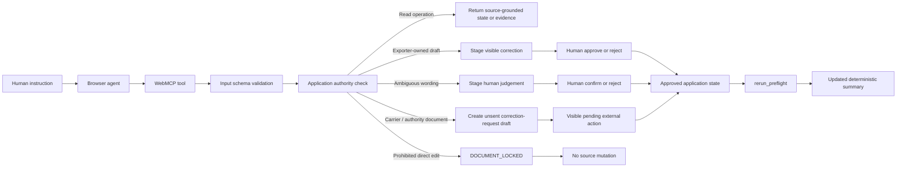

# WebMCP Authority Flow

This focused authority-flow diagram complements the system architecture overview in the README. It shows the control boundary that differentiates the project from a generic document assistant.

## Boundary represented by the diagram

The agent does not receive a universal `edit_document` or `execute_javascript` capability.

The application owns the authority decision:

- read tools may inspect state and evidence without mutation;
- exporter-owned Commercial Invoice and Packing List fields may receive staged proposals;
- Letter of Credit, Bill of Lading, and Certificate of Origin remain immutable;
- external-issuer problems produce drafts only;
- ambiguous descriptions require human judgement;
- the agent cannot approve its own exporter corrections or confirm its own human-review proposal;
- every write path uses the same reducer actions as the manual interface.

This is the WebMCP thesis of the project: the website exposes domain operations to the agent while retaining responsibility for what those operations are allowed to change.
